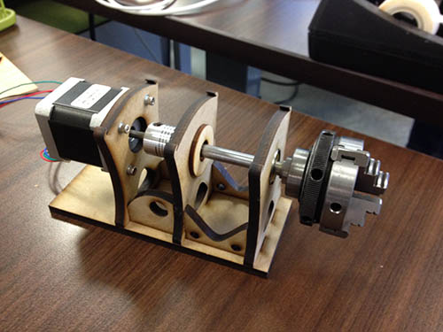

# Lathser

By Lawrence Kesteloot and Kurt Schaefer.

(Pronounced *lathe-zer*.) This project lets you cut a 3D shape using a 2D laser
cutter by rotating the piece as it's being cut.

The stock piece (an acrylic or wooden rod) is held and rotated by this machine
built by Kurt:

The `outline.py` script loads a 3D model and generates profile SVG files that can be
imported into Illustrator to cut the outlines from various angles.

